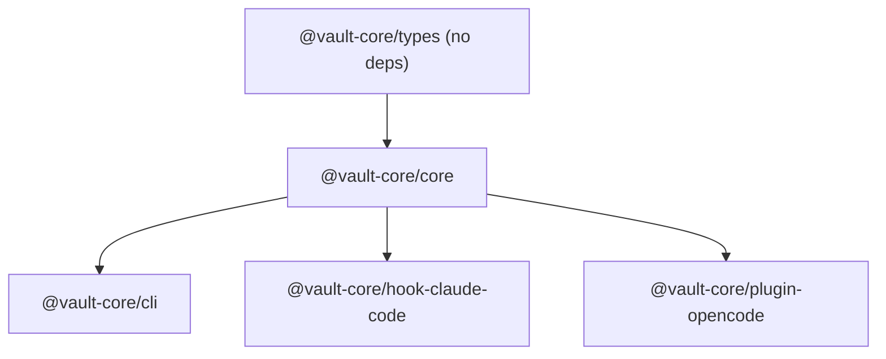

# ADR-013: Five-Package Monorepo with Strict Dependency DAG

**Status**: Accepted

## Context

The system needs to be deployed in multiple contexts: as a library, a CLI, a Claude Code hook, and an OpenCode plugin. A single package would couple these concerns. An unstructured monorepo risks circular dependencies.

## Decision

The monorepo contains five packages with a strictly enforced one-way dependency graph:

`@vault-core/types` contains only interfaces and zero runtime code. `@vault-core/core` contains all business logic. The three leaf packages are thin adapters.

TypeScript project references enforce the DAG at compile time.

## Consequences

- Each package can be published independently
- Hook and plugin packages remain thin — business logic changes happen in `core`
- `types` package can be consumed by external packages without pulling in runtime dependencies
- Adding a new integration target requires a new leaf package, not changes to `core`
- Cross-cutting changes (e.g. adding a new memory field) require coordinated updates across multiple packages
