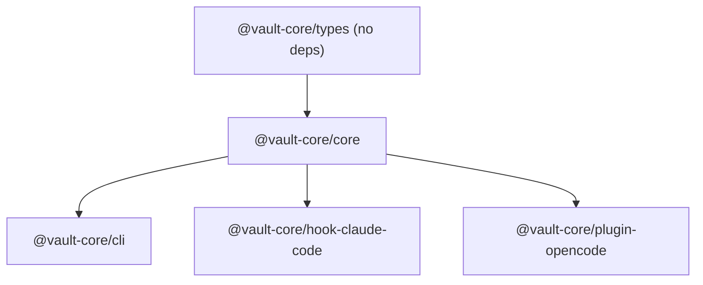

# AGENTS.md

Guidance for AI coding agents working in this repository.

## Repository overview

This is a **Bun monorepo** (`vault-core/`) containing five TypeScript packages that implement persistent memory for AI coding agents. The packages form a strict dependency DAG:



## Essential commands

Run all commands from `vault-core/`:

```bash
bun install              # install dependencies
bun run build            # compile all packages (tsc --build)
bun run typecheck        # type-check all packages (no emit)
bun run test:bdd         # run BDD integration tests (Cucumber)
bun run install:hooks    # register hooks with Claude Code and OpenCode
bun run install:skills   # copy SKILL.md files to harness skill directories
bun run install:cli      # make vault-cli globally available
```

Always run `bun run typecheck` after making changes. Run `bun run test:bdd` to verify integration.

## Code conventions

- **Language**: TypeScript with strict mode (`strict: true`, `exactOptionalPropertyTypes: true`, `noUncheckedIndexedAccess: true`)
- **Runtime**: Bun — use `bun:sqlite` (not `better-sqlite3`), use `bun:test` (not Jest/Vitest). Biome enforces this via `noRestrictedImports`.
- **Module system**: `NodeNext` — use `.js` extensions in imports even for `.ts` source files
- **No comments**: do not add comments to code unless explicitly requested
- **No unused imports**: TypeScript strict mode will flag these
- **Arrow functions**: prefer arrow functions (`const f = () => {}`) over named function declarations (`function f() {}`). Enforced by Biome `complexity/useArrowFunction`.
- **One exported function per module**: each source file should export at most one primary function or class. Extract helpers to their own files.
- **Max 110 non-blank lines per file**: enforced by Biome `nursery/noExcessiveLinesPerFile` (`maxLines: 110, skipBlankLines: true`).
- **Test colocation**: unit/colocated tests live next to the source file they test (e.g. `sweep-scan.test.ts` beside `sweep.ts`). Integration tests live in `packages/core/src/__tests__/integration/`.
- **Test coverage**: maintain >90% line coverage. Run `bun test --coverage` to check. This is not automatically enforced — verify manually before merging.

### Import style

```typescript
import { Memory } from "@vault-core/types";
import type { VaultCoreConfig } from "@vault-core/types";
```

Use `import type` for type-only imports.

### File naming

- Source files: `kebab-case.ts`
- Test files colocated with source: `<source-file-name>.test.ts` or `<source-file-name>-<describe>.test.ts`
- Integration test files: `T<nn>-description.test.ts` (see existing test suite)

## Package locations

| Package | Path | Purpose |
|---------|------|---------|
| `@vault-core/types` | `packages/types/src/` | Shared interfaces — zero runtime code |
| `@vault-core/core` | `packages/core/src/` | Main library — capture, storage, retrieval, consolidation |
| `@vault-core/cli` | `packages/cli/src/` | `vault-cli` binary (Commander.js) |
| `@vault-core/hook-claude-code` | `packages/hook-claude-code/src/` | Claude Code hook scripts |
| `@vault-core/plugin-opencode` | `packages/plugin-opencode/src/` | OpenCode plugin |

## Key source files

| File | Role |
|------|------|
| `packages/core/src/config.ts` | Config loading from `~/.vault-core/config.toml` |
| `packages/core/src/capture/queue.ts` | Async capture queue (non-blocking) |
| `packages/core/src/capture/sweep.ts` | Rule-based signal detection |
| `packages/core/src/storage/index-db.ts` | SQLite schema + FTS5 + vector operations |
| `packages/core/src/storage/vault-writer.ts` | Atomic Markdown writes to Obsidian vault |
| `packages/core/src/storage/vault-reader.ts` | Markdown reads + human-edit detection |
| `packages/core/src/scoring/scorer.ts` | 7-factor importance score |
| `packages/core/src/scoring/embedder.ts` | Embedding abstraction (Harness/Local) |
| `packages/core/src/retrieval/retriever.ts` | BM25 + vector RRF hybrid search |
| `packages/core/src/retrieval/injector.ts` | Token-budgeted context formatter |
| `packages/core/src/consolidation/proposer.ts` | Episodic clustering |
| `packages/core/src/consolidation/adjudicator.ts` | LLM-based conflict resolution |
| `packages/core/src/consolidation/approval.ts` | Human approval via vault inbox |
| `packages/cli/src/index.ts` | CLI entry point — registers commands from `commands/` |
| `packages/cli/src/commands/` | One file per CLI command |
| `packages/hook-claude-code/src/loader.ts` | Shared hook core initialisation |
| `packages/hook-claude-code/src/post-tool.ts` | PostToolUse hook entry point |
| `packages/hook-claude-code/src/session-stop.ts` | Stop hook entry point |
| `packages/plugin-opencode/src/plugin.ts` | OpenCode plugin entry point |

## Testing

Integration tests use full Cucumber BDD with Gherkin `.feature` files and TypeScript step definitions.

- Feature files: `packages/core/src/__tests__/features/*.feature`
- Step definitions: `packages/core/src/__tests__/features/steps/*.ts`
- Shared world: `packages/core/src/__tests__/features/steps/world.ts`
- Runner config: `cucumber.json` at workspace root

| Feature file | What it covers |
|---|---|
| `T01-capture-retrieve-roundtrip.feature` | Full pipeline: write → index → search |
| `T02-scope-isolation.feature` | Project scope filtering correctness |
| `T03-human-edit-immunity.feature` | External edit detection via mtime |
| `T04-conflict-detection.feature` | Vector fallback when sqlite-vec unavailable |
| `T05-consolidation-proposal.feature` | Episodic clustering and approval rendering |
| `T06-queue-durability.feature` | `pending.jsonl` persistence across restart |
| `T07-token-budget.feature` | Injector token budget enforcement |
| `T08-signal-detection.feature` | Sweep signal detection rules |
| `T09-retrieval-ranking.feature` | Hybrid search result ranking |
| `T09a-retrieval-filtering.feature` | Retrieval scope and tier filtering |

Tests use real filesystem (temp dirs) and real SQLite. No mocking except `MockAdjudicator` in T05.

When adding new functionality, add a corresponding `.feature` file and step definitions following the `T<nn>-description.feature` naming pattern. Tag each feature with `@T<nn>` and add matching `Before`/`After` hooks in the step file.

## Memory model (domain concepts)

Understanding these concepts is important when working on this codebase:

- **Episodic memory** — time-bound session events; decay is allowed
- **Semantic memory** — distilled facts/rules; only change via explicit reconsolidation
- **Procedural memory** — how-to processes; permanent until explicitly revoked
- **Strength** — composite score (0–1) reflecting memory durability
- **ImportanceScore** — 7-factor score: recency, frequency, importance, utility, novelty, confidence, interference
- **Human-edited** — memories with `human_edited_at` set are immune to automated reconsolidation

## Design constraints

- Capture must be non-blocking. `CaptureQueue.capture()` must return immediately.
- Writes to the vault are atomic: write to `.tmp` then rename.
- The SQLite index is derived and rebuildable from vault Markdown files via `vault-cli index`.
- Human edits in Obsidian are ground truth — never overwrite a memory with `human_edited_at` set.
- Do not add Ebbinghaus-style time decay to semantic or procedural memories.
- Vector search (sqlite-vec) is optional — the system must degrade gracefully to BM25-only.

## Runtime file paths

| Path | Purpose |
|------|---------|
| `~/.vault-core/config.toml` | Configuration file |
| `~/.vault-core/index.db` | SQLite index |
| `~/.vault-core/audit.jsonl` | Append-only audit log |
| `~/.vault-core/pending.jsonl` | Capture queue durability buffer |
| `~/.vault-core/consolidation-queue.jsonl` | Consolidation proposals buffer |
| `<vault_path>/00-inbox/` | Consolidation approval inbox |
| `<vault_path>/01-episodic/` | Episodic tier Markdown files |
| `<vault_path>/02-semantic/` | Semantic tier Markdown files |
| `<vault_path>/03-procedural/` | Procedural tier Markdown files |

## Documentation

All documentation lives in `docs/`. Update relevant docs when making changes to:

- CLI commands → `docs/cli.md`
- Configuration keys → `docs/configuration.md`
- Hook/plugin behavior → `docs/hooks.md`
- Public API → `docs/api.md`
- Architecture → `docs/architecture.md`

## Agent Rules <!-- tessl-managed -->

@.tessl/RULES.md follow the [instructions](.tessl/RULES.md)
