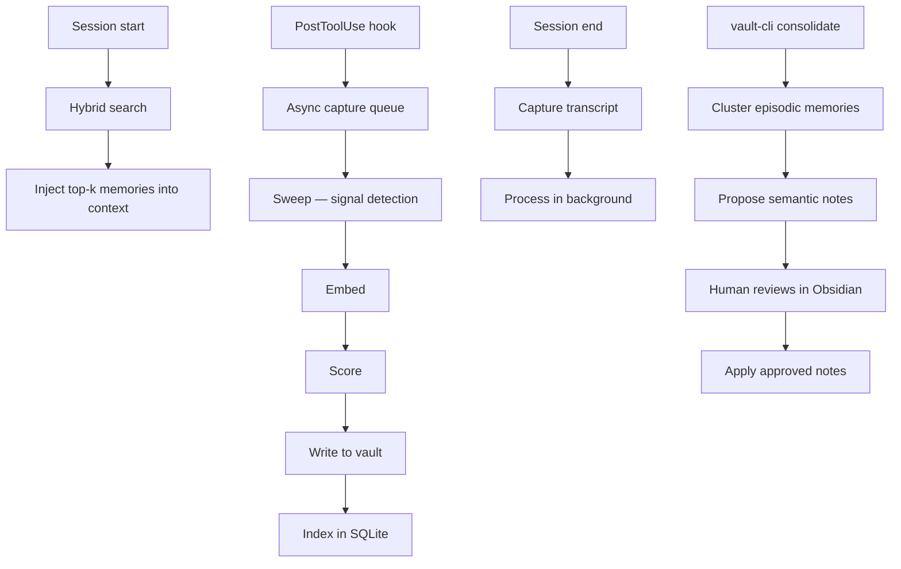

# mneme / vault-core

[](LICENSE)
[](https://scorecard.dev/viewer/?uri=github.com/pantheon-org/mneme)

Psychology-grounded, Obsidian-backed persistent memory for AI coding agents.

AI coding agents (Claude Code, OpenCode) have no memory between sessions. vault-core solves this by automatically capturing important decisions, constraints, bugs, and patterns during sessions, storing them in an Obsidian vault, and injecting the most relevant memories at the start of each new session.

## Why vault-core?

| Problem | vault-core approach |
|---------|-------------------|
| Agents forget architectural decisions between sessions | Semantic memories never decay — they only change via explicit reconsolidation |
| Keyword matching misses implicit context | Dense vector embeddings (cosine similarity) catch semantic overlap |
| Injecting all memories bloats context | Hybrid BM25 + vector search injects only top-k relevant memories |
| Memory capture blocks the agent | Async capture queue — hooks return in < 5ms |
| Memories locked in opaque databases | Open vault — all memories are browsable Markdown in Obsidian |
| Automatic overwrites lose nuance | Human edits are immune to automated reconsolidation |

## Memory model

vault-core separates three memory tiers, inspired by cognitive psychology:

- **Episodic** — time-bound session events; decay is allowed
- **Semantic** — distilled facts and rules; only change via explicit reconsolidation
- **Procedural** — how-to processes; permanent until explicitly revoked

## Requirements

- [Bun](https://bun.sh) >= 1.0
- Claude Code or OpenCode (as the AI harness)
- [Obsidian](https://obsidian.md) (optional, for browsing the vault)

## Installation

```bash
git clone https://github.com/pantheon-org/mneme.git
cd mneme/vault-core

bun install
bun run build
bun run install:cli      # installs vault-cli globally
bun run install:hooks    # registers hooks with Claude Code and OpenCode
bun run install:skills   # copies SKILL.md files to harness skill directories
```

## Quick start

```bash
# Capture a memory manually
vault-cli capture --text "We use strict TypeScript null checks across the whole project" --tier semantic

# Search memories
vault-cli search "typescript configuration"

# Show recent episodic memories
vault-cli recent --limit 20

# Check vault status
vault-cli status

# Consolidate episodic → semantic
vault-cli consolidate --propose
vault-cli consolidate --apply
```

Once hooks are installed, memories are captured and injected automatically — no manual intervention needed.

## How it works



## Project structure

```
mneme/
├── vault-core/                  # Bun workspace monorepo
│   ├── packages/
│   │   ├── types/               # @vault-core/types — shared interfaces
│   │   ├── core/                # @vault-core/core — main library
│   │   ├── cli/                 # @vault-core/cli — vault-cli binary
│   │   ├── hook-claude-code/    # @vault-core/hook-claude-code
│   │   └── plugin-opencode/     # @vault-core/plugin-opencode
│   └── skills/                  # Harness-agnostic SKILL.md files
├── docs/                        # Technical documentation
└── scripts/                     # Repository-level scripts
```

## Documentation

- [Architecture](docs/architecture.md)
- [CLI reference](docs/cli.md)
- [Configuration](docs/configuration.md)
- [Hooks and plugins](docs/hooks.md)
- [API reference](docs/api.md)
- [Psychology design rationale](docs/psychology-based.md)
- [Contributing](CONTRIBUTING.md)

## License

MIT
