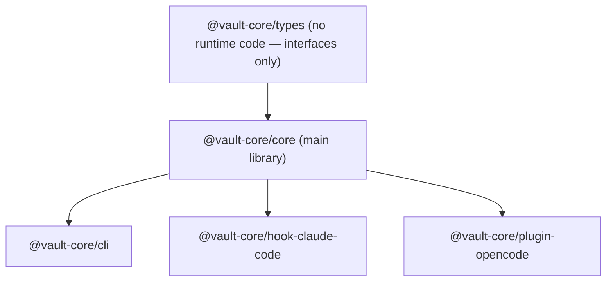
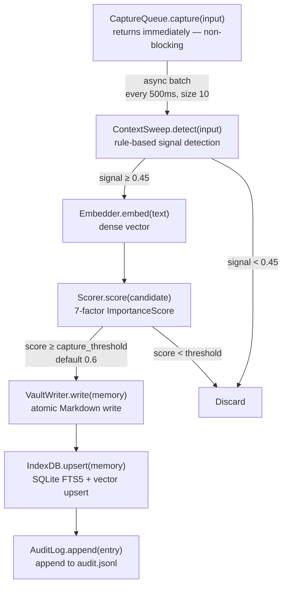
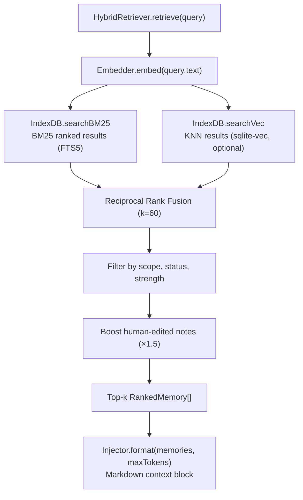
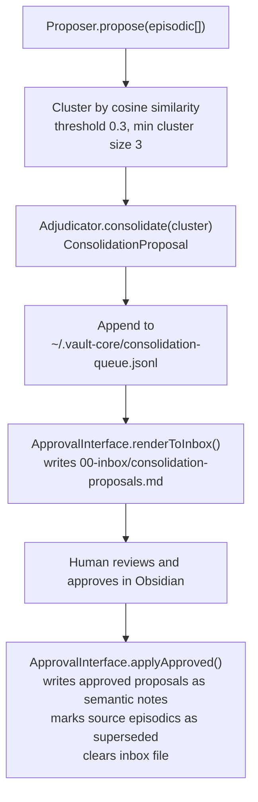

# Architecture

vault-core is a Bun workspace monorepo of five TypeScript packages that implement
psychology-grounded persistent memory for AI coding agents.

## Package dependency graph



## Storage model

The system uses a two-tier storage architecture:

1. **Obsidian vault** (Markdown files) — source of truth
2. **SQLite index** (`~/.vault-core/index.db`) — derived, fully rebuildable via `vault-cli index`

Every memory is a Markdown file with YAML frontmatter stored under the vault path. The SQLite
index enables fast BM25 full-text search and (optionally) KNN vector search. The index can always
be discarded and rebuilt from the vault.

### Vault directory layout

```text
<vault_path>/
├── 00-inbox/
│   └── consolidation-proposals.md   # pending human approvals
├── 01-episodic/
│   └── <id>.md                      # episodic tier memories
├── 02-semantic/
│   └── <id>.md                      # semantic tier memories
└── 03-procedural/
    └── <id>.md                      # procedural tier memories
```

### Memory Markdown format

Each memory is a `.md` file with this structure:

```yaml
---
id: mem_abc123
tier: episodic          # episodic | semantic | procedural
scope: project          # user | project
category: decision      # decision | constraint | pattern | bugfix | discovery | preference
status: active          # active | superseded | archived
summary: "Short summary of the memory"
tags: [typescript, architecture]
project_id: my-project
strength: 0.82
importance_score: 0.75
frequency_count: 3
source_type: hook       # hook | cli | manual
source_harness: claude-code
source_session: sess_xyz
captured_at: 2026-03-10T14:23:00Z
updated_at: 2026-03-10T14:23:00Z
human_edited_at: null
---

Memory content goes here.
```

Writes are atomic: content is written to `<file>.tmp` and then renamed to `<file>`, preventing partial reads.

## Memory tiers

Three tiers map to cognitive psychology concepts:

| Tier            | Decay                                 | Reconsolidation                                    |
|-----------------|---------------------------------------|----------------------------------------------------|
| **Episodic**    | Allowed (time-bounded session events) | Automatic via consolidation pipeline               |
| **Semantic**    | None — binary existence               | Only via explicit reconsolidation or human edit    |
| **Procedural**  | None — permanent                      | Only via explicit revocation or human edit         |

Ebbinghaus-style exponential time decay is applied only to episodic memories. Semantic and
procedural memories are never decayed.

## Capture pipeline



Durability: items that fail processing are persisted to `~/.vault-core/pending.jsonl` and replayed on next startup.

### Signal detection (ContextSweep)

The sweep uses rule-based detection without an LLM call, keeping capture non-blocking:

- **Keyword rules** — 6 patterns mapped to categories: decision, constraint, bugfix, pattern, discovery, preference
- **Structural rules** — enumeration patterns, correction phrases, error indicators
- **Caller hints** — explicit `CaptureHints` passed by the hook/CLI caller

Pre-filter threshold: 0.45 composite signal confidence. Inputs below this are discarded before embedding.

### Importance scoring (Scorer)

Seven factors, each weighted by `scoring_weights` in config:

| Factor          | Weight (default) | Description                                          |
|-----------------|------------------|------------------------------------------------------|
| `recency`       | 0.25             | Exponential decay with 7-day half-life               |
| `importance`    | 0.20             | Signal confidence with 0.8^i diminishing returns     |
| `utility`       | 0.20             | importance × confidence                              |
| `frequency`     | 0.15             | Access frequency count                               |
| `novelty`       | 0.10             | 1 − max cosine similarity against top-50 neighbours  |
| `confidence`    | 0.05             | Mean signal confidence                               |
| `interference`  | 0.05             | Penalty applied when novelty < 0.3                   |

If the composite score falls below `capture_threshold`, the candidate is rejected.

## Retrieval pipeline



Token budget enforcement: 4 chars ≈ 1 token. The injector never truncates mid-note and always
includes the first memory regardless of budget.

Vector search (sqlite-vec) is optional. If the extension is unavailable, the system degrades gracefully to BM25-only.

## Consolidation pipeline



The `Adjudicator` makes LLM inference calls via `inference_command` (a subprocess) to:

- Resolve conflicts between two memories (`conflict_resolution`)
- Synthesize a cluster into a semantic note (`consolidation`)

## Embedder abstraction

Two implementations, selected by config and availability:

| Implementation    | Mechanism                                              | Used when                                          |
|-------------------|--------------------------------------------------------|----------------------------------------------------|
| `HarnessEmbedder` | Calls `inference_command` subprocess with JSON payload | Default; works with any harness that exposes a CLI |
| `LocalEmbedder`   | `@xenova/transformers` (dynamically imported)          | When configured and the package is available       |

`LocalEmbedder` falls back to `HarnessEmbedder` if the local model is unavailable.

## Hook integration

### Claude Code

Three hook scripts are registered in `~/.claude/settings.json`:

| Hook               | Trigger                   | Action                                                |
|--------------------|---------------------------|-------------------------------------------------------|
| `session-start.ts` | `SessionStart`            | Embed session context → retrieve top-k → inject       |
| `post-tool.ts`     | `PostToolUse` (all tools) | Read tool event from stdin → enqueue for capture      |
| `session-stop.ts`  | `Stop`                    | Read transcript from `CLAUDE_TRANSCRIPT_PATH` → queue |

### OpenCode

A single plugin (`plugin-opencode`) handles two hooks:

| Hook                                 | Action                                                        |
|--------------------------------------|---------------------------------------------------------------|
| `tool.execute.after`                 | Capture tool name and args via `CaptureQueue` (non-blocking)  |
| `experimental.chat.system.transform` | Retrieve top-7 relevant memories → inject into system prompt  |

## SQLite schema

**`memories` table**

```sql
CREATE TABLE memories (
  id          TEXT PRIMARY KEY,
  tier        TEXT NOT NULL,
  scope       TEXT NOT NULL,
  status      TEXT NOT NULL,
  category    TEXT NOT NULL,
  summary     TEXT NOT NULL,
  content     TEXT NOT NULL,
  tags        TEXT NOT NULL DEFAULT '[]',
  project_id  TEXT,
  strength    REAL NOT NULL DEFAULT 1.0,
  file_path   TEXT NOT NULL,
  captured_at TEXT NOT NULL,
  updated_at  TEXT NOT NULL,
  mtime_ns    INTEGER NOT NULL DEFAULT 0
);
```

**`memories_fts` virtual table** (FTS5 for BM25)

```sql
CREATE VIRTUAL TABLE memories_fts USING fts5(id, summary, content, tags);
```

**`memory_vecs` table** (optional KNN)

```sql
CREATE TABLE memory_vecs (
  id        TEXT PRIMARY KEY,
  embedding TEXT NOT NULL DEFAULT '[]'
);
```

The database is opened with `PRAGMA journal_mode=WAL`.

## Human-edit immunity

`VaultReader` detects external edits by comparing `mtime` of the file against the stored
`updated_at` timestamp. When a mismatch is found, `human_edited_at` is set on the memory in the
index. Memories with `human_edited_at` set are never overwritten by automated reconsolidation.

## Design invariants

1. `CaptureQueue.capture()` returns immediately — never blocks the agent
2. Vault writes are atomic — `.tmp` file written then renamed
3. The SQLite index is derived and fully rebuildable from vault Markdown files
4. Human-edited memories are immune to automated reconsolidation
5. Ebbinghaus decay applies only to episodic tier — never semantic or procedural
6. Vector search is optional — all paths degrade gracefully to BM25-only
7. Injection respects token budget — never truncates mid-note

## Crash recovery

The capture pipeline writes to the vault first (`VaultWriter.write`) then to SQLite (`IndexDB.upsert`). These two operations are not wrapped in a single transaction, so a crash between them leaves the vault and SQLite index diverged.

**Recovery mechanism:** `reconcile(db, reader, vaultPath)` scans the three tier directories (`01-episodic/`, `02-semantic/`, `03-procedural/`) for `.md` files and performs two operations:

- **Insert** rows for vault files that have no corresponding SQLite row (by `id`)
- **Delete** SQLite rows whose `file_path` no longer exists on disk (orphaned rows)

It returns `{ inserted: number, deleted: number }`. `reconcile` is called automatically on VaultCore initialisation (in both the CLI core loader and the hook core loader). It can also be triggered manually via `vault-cli index`.

**Recovery procedure (manual):**

```bash
vault-cli index
```

This command reads every `.md` file under `vault_path`, upserts each into SQLite, and removes rows whose corresponding vault file has been deleted. Both insert and delete counts are logged.
