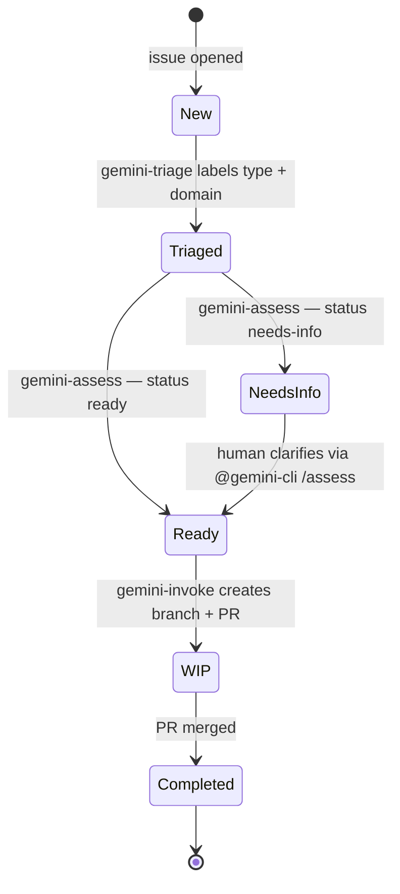
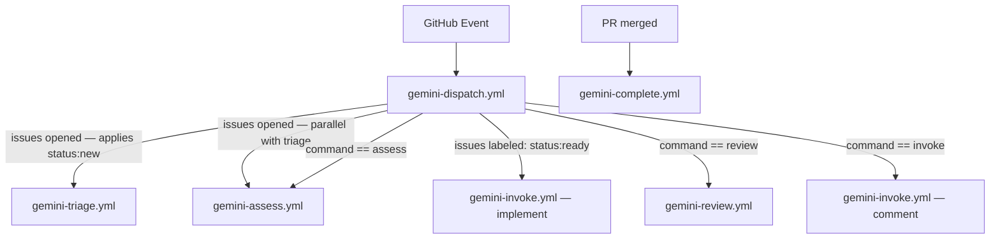

# Issue Lifecycle

A label-driven issue lifecycle that ties GitHub labels to automated workflow triggers, moving an issue from creation through triage, implementation, and closure without manual intervention beyond the initial write-up.

---

## Lifecycle overview

---

## Stages

### Stage 1 — New (`status: new`)

Auto-applied by a `github-script` step in `gemini-dispatch` before triage and assess fire.
Signals that the issue has not yet been reviewed.

Parallel triggers: `gemini-triage` + `gemini-assess`.

---

### Stage 2 — Triaged

`gemini-triage` removes `status: new` and applies:

#### Type labels — exactly one

| Label | Meaning |
|---|---|
| `bug` | Something is broken or behaves incorrectly |
| `enhancement` | New feature or improvement to existing behaviour |
| `chore` | Maintenance, tooling, configuration — no functional change |
| `documentation` | Documentation addition or correction |
| `question` | Clarification request, no code change expected |
| `good first issue` | Well-scoped, suitable for new contributors |

#### Domain labels — one or more

Validated against the existing issue backlog (9 issues). Existing flat labels (`reliability`, `data-integrity`, `durability`, `governance`, `performance`) are migrated to the `domain:` namespace for consistency with `package:`, `priority:`, and `status:` prefixes. `durability` is merged into `domain: reliability`.

| Label | Scope | Validated by |
|---|---|---|
| `domain: data-integrity` | Atomic writes, vault consistency, human-edit immunity | #1, #2, #4, #7 |
| `domain: reliability` | Queue durability, crash recovery, graceful degradation | #1, #4, #6, #7, #8 |
| `domain: governance` | Consolidation, conflict resolution, approval flows | #9 |
| `domain: performance` | Latency, token budgets, embedding throughput | #5 |
| `domain: security` | Auth, prompt injection, secret handling | — |
| `domain: dx` | CLI usability, hook ergonomics, developer experience | — |

#### Package labels — one or more (existing)

`package: types` · `package: core` · `package: cli` · `package: hook-claude-code` · `package: plugin-opencode`

#### Priority labels — exactly one (existing)

`priority: high` · `priority: medium` · `priority: low`

---

### Stage 3 — Assessed

`gemini-assess` runs in parallel with triage and applies one of:

| Label | Meaning |
|---|---|
| `status: ready` | Issue is self-contained and can be started immediately |
| `status: needs-info` | Requires human clarification before work can begin |

When `status: needs-info` is set, the assessment comment lists what is missing. Once the author clarifies, a human re-triggers with `@gemini-cli /assess`. When `status: ready` is applied the lifecycle advances automatically.

`@gemini-cli /triage` can be used at any point to correct type, domain, package, or priority labels. It may also change status, subject to the following rules:

| Current status | Re-triage may update status? |
|---|---|
| `status: new` | Yes |
| `status: needs-info` | Yes |
| `status: ready` | Yes — can roll back to `needs-info` if scope changes |
| `status: wip` | **No** — a PR is open; status is owned by automation |
| `status: completed` | **No** — issue is closed |

---

### Stage 4 — Work in progress (`status: wip`)

Triggered by the `issues: labeled` event when `label.name == 'status: ready'`. `gemini-invoke` runs a **full implementation**:

1. Creates a feature branch (`fix/<issue-number>-<slug>` or `feat/<issue-number>-<slug>`)
2. Implements the change following all repository conventions (see `AGENTS.md`)
3. Runs `bun run typecheck` and `bun run test:bdd` before committing
4. Opens a PR with `Closes #<issue-number>` in the description
5. Removes `status: ready`, applies `status: wip` on the issue

---

### Stage 5 — Completed (`status: completed`)

When the linked PR is merged, a `gemini-complete` workflow fires (`pull_request: closed` + `merged == true`):

1. Removes `status: wip` (and `status: ready` if somehow still present)
2. Applies `status: completed`
3. GitHub auto-closes the issue via `Closes #` in the PR body

---

## Required label set

Labels marked **new** must be created before the workflows go live.
Domain labels are marked **proposed** pending taxonomy confirmation.

| Label | Color | Status |
|---|---|---|
| `status: new` | `#e4e669` | **new** |
| `status: ready` | `#0075ca` | **new** |
| `status: needs-info` | `#d93f0b` | **new** |
| `status: wip` | `#6f42c1` | **new** |
| `status: completed` | `#0e8a16` | **new** |
| `bug` | `#d73a4a` | existing |
| `enhancement` | `#a2eeef` | existing |
| `documentation` | `#0075ca` | existing |
| `question` | `#d876e3` | existing |
| `good first issue` | `#7057ff` | existing |
| `package: types` | `#bfd4f2` | existing |
| `package: core` | `#bfd4f2` | existing |
| `package: cli` | `#bfd4f2` | existing |
| `package: hook-claude-code` | `#bfd4f2` | existing |
| `package: plugin-opencode` | `#bfd4f2` | existing |
| `priority: high` | `#b60205` | existing |
| `priority: medium` | `#fbca04` | existing |
| `priority: low` | `#0e8a16` | existing |
| `chore` | `#ededed` | **new** |
| `domain: data-integrity` | `#c5def5` | **new** (replaces `data-integrity`) |
| `domain: reliability` | `#c5def5` | **new** (replaces `reliability` + `durability`) |
| `domain: governance` | `#c5def5` | **new** (replaces `governance`) |
| `domain: performance` | `#c5def5` | **new** (replaces `performance`) |
| `domain: security` | `#e11d48` | **new** |
| `domain: dx` | `#c5def5` | **new** |

---

## Workflow routing

