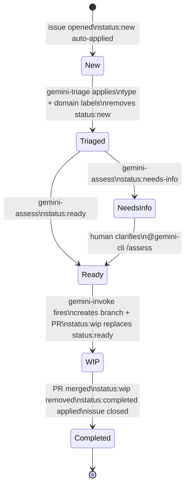

# Issue Lifecycle

A label-driven issue lifecycle that ties GitHub labels to automated workflow triggers, moving an issue from creation through triage, implementation, and closure without manual intervention beyond the initial write-up.

---

## Lifecycle overview



---

## Stages

### Stage 1 — New (`status: new`)

Auto-applied by a `github-script` step in `gemini-dispatch` before triage and assess fire.
Signals that the issue has not yet been reviewed.

Parallel triggers: `gemini-triage` + `gemini-assess`.

---

### Stage 2 — Triaged

`gemini-triage` removes `status: new` and applies:

#### Type labels — exactly one

| Label | Meaning |
|---|---|
| `bug` | Something is broken or behaves incorrectly |
| `enhancement` | New feature or improvement to existing behaviour |
| `documentation` | Documentation addition or correction |
| `question` | Clarification request, no code change expected |
| `good first issue` | Well-scoped, suitable for new contributors |

#### Domain labels — one or more

> Domain taxonomy is under investigation. The list below is a working proposal.

| Label | Scope |
|---|---|
| `domain: data-integrity` | Atomic writes, vault consistency, human-edit immunity |
| `domain: reliability` | Queue durability, crash recovery, graceful degradation |
| `domain: governance` | Consolidation, conflict resolution, approval flows |
| `domain: performance` | Latency, token budgets, embedding throughput |
| `domain: security` | Auth, prompt injection, secret handling |
| `domain: dx` | CLI usability, hook ergonomics, developer experience |

#### Package labels — one or more (existing)

`package: types` · `package: core` · `package: cli` · `package: hook-claude-code` · `package: plugin-opencode`

#### Priority labels — exactly one (existing)

`priority: high` · `priority: medium` · `priority: low`

---

### Stage 3 — Assessed

`gemini-assess` runs in parallel with triage and applies one of:

| Label | Meaning |
|---|---|
| `status: ready` | Issue is self-contained and can be started immediately |
| `status: needs-info` | Requires human clarification before work can begin |

When `status: needs-info` is set, the assessment comment lists what is missing. Once the author clarifies, a human re-triggers with `@gemini-cli /assess`. When `status: ready` is applied the lifecycle advances automatically.

---

### Stage 4 — Work in progress (`status: wip`)

Triggered by the `issues: labeled` event when `label.name == 'status: ready'`. `gemini-invoke` runs a **full implementation**:

1. Creates a feature branch (`fix/<issue-number>-<slug>` or `feat/<issue-number>-<slug>`)
2. Implements the change following all repository conventions (see `AGENTS.md`)
3. Runs `bun run typecheck` and `bun run test:bdd` before committing
4. Opens a PR with `Closes #<issue-number>` in the description
5. Removes `status: ready`, applies `status: wip` on the issue

---

### Stage 5 — Completed (`status: completed`)

When the linked PR is merged, a `gemini-complete` workflow fires (`pull_request: closed` + `merged == true`):

1. Removes `status: wip` (and `status: ready` if somehow still present)
2. Applies `status: completed`
3. GitHub auto-closes the issue via `Closes #` in the PR body

---

## Required label set

Labels marked **new** must be created before the workflows go live.
Domain labels are marked **proposed** pending taxonomy confirmation.

| Label | Color | Status |
|---|---|---|
| `status: new` | `#e4e669` | **new** |
| `status: ready` | `#0075ca` | **new** |
| `status: needs-info` | `#d93f0b` | **new** |
| `status: wip` | `#6f42c1` | **new** |
| `status: completed` | `#0e8a16` | **new** |
| `bug` | `#d73a4a` | existing |
| `enhancement` | `#a2eeef` | existing |
| `documentation` | `#0075ca` | existing |
| `question` | `#d876e3` | existing |
| `good first issue` | `#7057ff` | existing |
| `package: types` | `#bfd4f2` | existing |
| `package: core` | `#bfd4f2` | existing |
| `package: cli` | `#bfd4f2` | existing |
| `package: hook-claude-code` | `#bfd4f2` | existing |
| `package: plugin-opencode` | `#bfd4f2` | existing |
| `priority: high` | `#b60205` | existing |
| `priority: medium` | `#fbca04` | existing |
| `priority: low` | `#0e8a16` | existing |
| `domain: data-integrity` | `#c5def5` | **proposed** |
| `domain: reliability` | `#c5def5` | **proposed** |
| `domain: governance` | `#c5def5` | **proposed** |
| `domain: performance` | `#c5def5` | **proposed** |
| `domain: security` | `#e11d48` | **proposed** |
| `domain: dx` | `#c5def5` | **proposed** |

---

## Workflow changes required

| Trigger | Event | New behaviour |
|---|---|---|
| Issue opened | `issues: opened` | Auto-apply `status: new` before triage + assess |
| `status: ready` applied | `issues: labeled` | Fire `gemini-invoke` (full implementation), swap to `status: wip` |
| PR merged | `pull_request: closed` + `merged == true` | Remove `status: wip` / `status: ready`, apply `status: completed` |

Updated dispatch routing:

```mermaid
flowchart TD
    E[GitHub Event] --> D[gemini-dispatch.yml]
    D -->|issues opened/reopened| N[apply status:new]
    N --> T[gemini-triage.yml]
    N --> A[gemini-assess.yml]
    D -->|issues labeled: status:ready| I[gemini-invoke.yml]
    D -->|PR merged| C[gemini-complete.yml]
    D -->|command == review| R[gemini-review.yml]
    D -->|@gemini-cli no command| I
```

---

## Open questions

- **Domain taxonomy** — the six proposed domains need validation against the actual issue backlog before the labels are created. Consider running a pass over existing issues to see if the set is complete and non-overlapping.
- **Re-triage** — should `@gemini-cli /triage` be able to reset labels and status if an issue scope changes significantly after initial triage?
- **Label bootstrap** — should a one-off script or workflow create all new labels on first run, or are they created manually?
