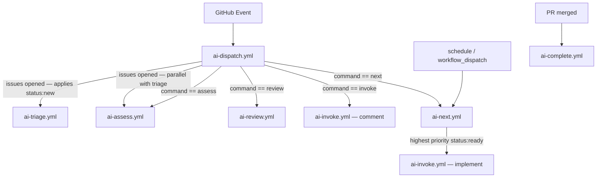

# GitHub Actions Workflows

This repository uses four workflows that together implement a AI-powered automation layer for pull requests and issues.

## Architecture

## Workflows

| Workflow | Document | Role |
|---|---|---|
| `ai-dispatch.yml` | [ai-dispatch.md](ai-dispatch.md) | Entry point — routes events to child workflows |
| `ai-triage.yml` | [ai-triage.md](ai-triage.md) | Labels and comments on new issues |
| `ai-assess.yml` | [ai-assess.md](ai-assess.md) | Assesses whether an issue is ready to be worked on |
| `ai-review.yml` | [ai-review.md](ai-review.md) | Reviews PRs against code conventions |
| `ai-next.yml` | [ai-next.md](ai-next.md) | Priority queue — picks and implements the next ready issue |
| `ai-invoke.yml` | [ai-invoke.md](ai-invoke.md) | Ad-hoc requests and full issue implementation |
| `ai-complete.yml` | [ai-complete.md](ai-complete.md) | Closes lifecycle on PR merge |

## Shared configuration

| Variable / Secret | Required | Purpose |
|---|---|---|
| `secrets.GEMINI_API_KEY` | Yes | Authenticates all Gemini CLI calls (primary) |
| `secrets.CEREBRAS_API_KEY` | No | Fallback inference — see [../ai-setup/cerebras-setup.md](../ai-setup/cerebras-setup.md) |
| `secrets.MISTRAL_API_KEY` | No | Secondary fallback — see [../ai-setup/mistral-setup.md](../ai-setup/mistral-setup.md) |
| `vars.GEMINI_MODEL` | No | Model name (e.g. `gemini-2.5-pro`) |
| `vars.GEMINI_CLI_VERSION` | No | Pins the `gemini` CLI binary version |
| `vars.GEMINI_DEBUG` | No | Enables verbose Gemini CLI output |

Telemetry is enabled on all workflows and written to `.gemini/telemetry.log` inside the runner workspace (not committed).

## Required permissions

| Permission | Reason |
|---|---|
| `contents: read` | Checkout |
| `id-token: write` | OIDC auth for `run-gemini-cli` |
| `issues: write` | Post comments, apply labels |
| `pull-requests: write` | Post PR review comments (dispatch, review, invoke) |
| `pull-requests: read` | Triage only needs read access |
