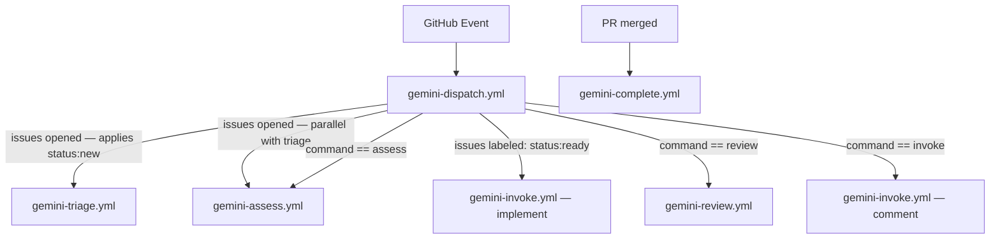

# GitHub Actions Workflows

This repository uses four workflows that together implement a Gemini CLI–powered automation layer for pull requests and issues.

## Architecture

## Workflows

| Workflow | Document | Role |
|---|---|---|
| `gemini-dispatch.yml` | [gemini-dispatch.md](gemini-dispatch.md) | Entry point — routes events to child workflows |
| `gemini-triage.yml` | [gemini-triage.md](gemini-triage.md) | Labels and comments on new issues |
| `gemini-assess.yml` | [gemini-assess.md](gemini-assess.md) | Assesses whether an issue is ready to be worked on |
| `gemini-review.yml` | [gemini-review.md](gemini-review.md) | Reviews PRs against code conventions |
| `gemini-invoke.yml` | [gemini-invoke.md](gemini-invoke.md) | Ad-hoc requests and full issue implementation |
| `gemini-complete.yml` | [gemini-complete.md](gemini-complete.md) | Closes lifecycle on PR merge |

## Shared configuration

| Variable / Secret | Purpose |
|---|---|
| `secrets.GEMINI_API_KEY` | Authenticates all Gemini CLI calls |
| `vars.GEMINI_MODEL` | Model name (e.g. `gemini-2.5-pro`) |
| `vars.GEMINI_CLI_VERSION` | Pins the `gemini` CLI binary version |
| `vars.GEMINI_DEBUG` | Enables verbose Gemini CLI output |

Telemetry is enabled on all workflows and written to `.gemini/telemetry.log` inside the runner workspace (not committed).

## Required permissions

| Permission | Reason |
|---|---|
| `contents: read` | Checkout |
| `id-token: write` | OIDC auth for `run-gemini-cli` |
| `issues: write` | Post comments, apply labels |
| `pull-requests: write` | Post PR review comments (dispatch, review, invoke) |
| `pull-requests: read` | Triage only needs read access |
